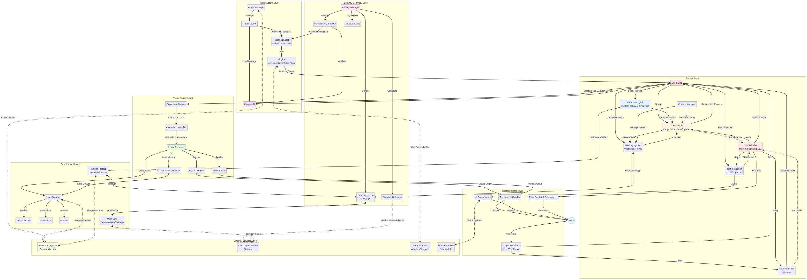
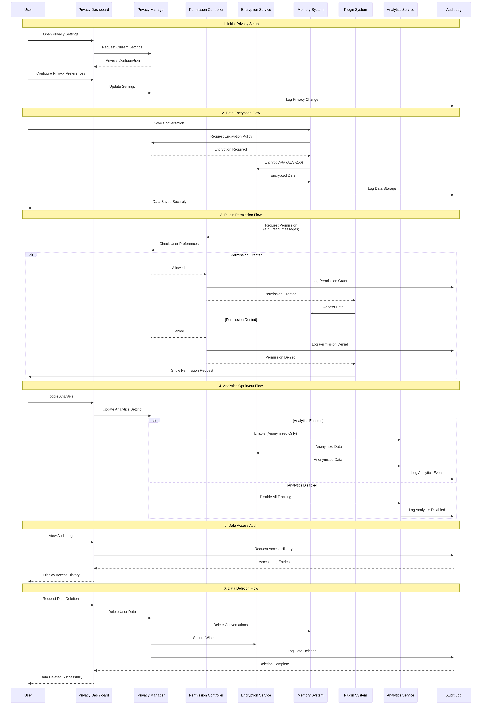
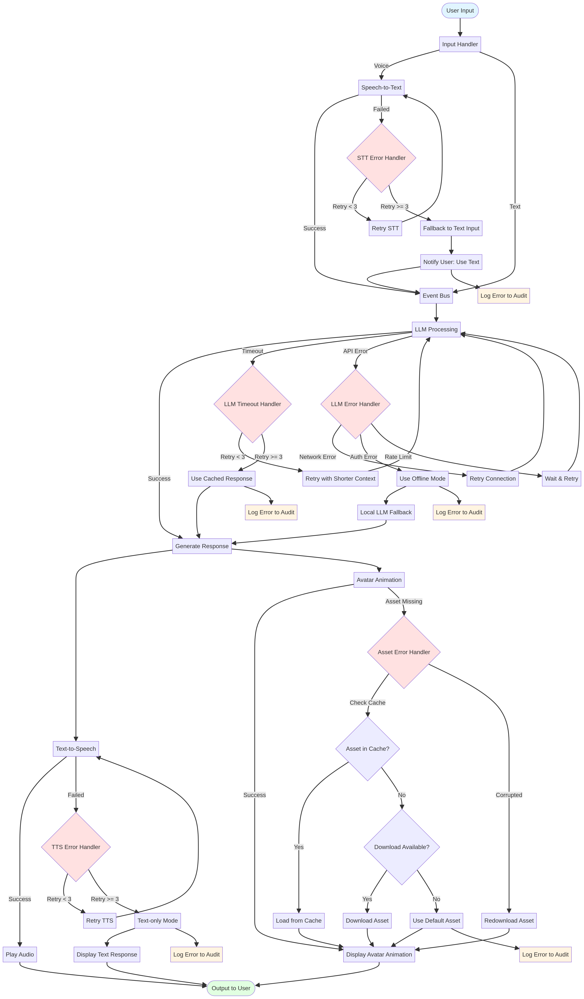

# สถาปัตยกรรมของระบบ AI VTuber Desktop Companion (ฉบับขั้นสูง)

เอกสารนี้อธิบายสถาปัตยกรรมโดยรวมของระบบ AI VTuber Desktop Companion ในเวอร์ชันที่รองรับการใช้งานจริง (production-ready) โดยได้เพิ่มมุมมองด้านความปลอดภัย, การจัดการข้อผิดพลาด, ระบบ Persona, และการเชื่อมต่อภายนอก

## ภาพรวมสถาปัตยกรรมขั้นสูง

จากสถาปัตยกรรมเดิม เราได้เพิ่ม 4 layers และส่วนประกอบใหม่ๆ เข้าไปเพื่อเพิ่มความสมบูรณ์ของระบบ:

### 1. Security & Privacy Layer (ใหม่)

ชั้นนี้ถูกเพิ่มเข้ามาเพื่อจัดการความปลอดภัยและความเป็นส่วนตัวของผู้ใช้โดยเฉพาะ

- **Privacy Manager:** ศูนย์กลางควบคุมนโยบายความเป็นส่วนตัวทั้งหมด
- **Data Encryption:** เข้ารหัสข้อมูลที่ละเอียดอ่อน (เช่น ประวัติการสนทนา, โปรไฟล์ Persona) ด้วย AES-256 ทั้งในขณะจัดเก็บ (at rest) และส่งผ่าน (in transit)
- **Permission Controller:** จัดการสิทธิ์การเข้าถึงของปลั๊กอินแต่ละตัว ผู้ใช้สามารถให้หรือปฏิเสธสิทธิ์ได้
- **Analytics Opt-in/out:** ระบบเก็บข้อมูลการใช้งานแบบไม่ระบุตัวตนที่ผู้ใช้สามารถเลือกเปิดหรือปิดได้
- **Data Audit Log:** บันทึกการเข้าถึงข้อมูลทั้งหมด เพื่อความโปร่งใสและตรวจสอบได้

### 2. Error Handler & Fallback (ใหม่)

ส่วนประกอบใหม่ที่เพิ่มเข้ามาใน Core AI Layer และ Avatar Engine Layer เพื่อจัดการกับข้อผิดพลาดที่อาจเกิดขึ้น

- **Error Handler (Core AI):** จัดการข้อผิดพลาดจากการทำงานของ AI เช่น LLM timeout, STT/TTS fail โดยมี logic การลองใหม่ (retry) และการใช้ระบบสำรอง (fallback)
- **Asset Fallback Handler (Avatar Engine):** หากไม่พบไฟล์ asset (เช่น โมเดล, animation) ระบบจะพยายามโหลด asset เริ่มต้น (default) แทนที่จะแครช
- **Error Display & Recovery UI (Desktop Client):** แสดงข้อผิดพลาดให้ผู้ใช้ทราบอย่างเป็นมิตร และแนะนำขั้นตอนการแก้ไขเบื้องต้น

### 3. Persona Engine (ใหม่)

โมดูลใหม่ใน Core AI Layer ที่ทำให้ AI มีบุคลิกที่หลากหลายและปรับแต่งได้

- **Persona Engine:** โหลดโปรไฟล์ Persona และปรับเปลี่ยน system prompt, รูปแบบการตอบสนอง, และพฤติกรรมของ LLM
- **Persona Profiles:** ไฟล์ configuration ที่กำหนดบุคลิกของ AI เช่น "ผู้ช่วยส่วนตัว", "เพื่อนสนิทขี้เล่น", หรือ "อาจารย์ผู้รอบรู้"
- **Custom Behavior & Training:** ในอนาคตจะรองรับการ train persona จากประวัติการสนทนาของผู้ใช้

### 4. External Services Layer (ใหม่)

ชั้นนี้แสดงถึงการเชื่อมต่อกับบริการภายนอก เพื่อขยายขีดความสามารถของโปรเจกต์ในอนาคต

- **Asset Marketplace:** แหล่งรวม Avatar, animation, และ persona ที่สร้างโดย community
- **Cloud Sync Service:** บริการซิงค์ข้อมูลและการตั้งค่าข้ามอุปกรณ์ (เป็นทางเลือก)
- **External APIs:** การเชื่อมต่อกับ API ภายนอก เช่น สภาพอากาศ, ข่าวสาร ผ่านระบบปลั๊กอิน
- **Update Service:** ระบบอัปเดตแอปพลิเคชันอัตโนมัติ

## การปรับปรุง Workflow

### Security & Privacy Flow

1.  **Plugin Permission:** ก่อนที่ปลั๊กอินจะเข้าถึงข้อมูลสำคัญ (เช่น ประวัติการแชท) มันจะต้องขอสิทธิ์จาก `Permission Controller` ก่อน ซึ่งจะตรวจสอบการตั้งค่าของผู้ใช้ใน `Privacy Manager`
2.  **Data Encryption:** เมื่อ `Memory System` บันทึกข้อมูล มันจะส่งข้อมูลไปเข้ารหัสที่ `Encryption Service` ก่อนจัดเก็บลง `User Data`
3.  **Audit Trail:** ทุกการเข้าถึงหรือเปลี่ยนแปลงข้อมูลสำคัญจะถูกบันทึกใน `Data Audit Log`

### Error Handling Flow

1.  **STT/TTS Failure:** หากระบบแปลงเสียงพูดเป็นข้อความ (หรือกลับกัน) ล้มเหลว `Error Handler` จะพยายามอีกครั้ง 2-3 ครั้ง หากยังล้มเหลว จะเปลี่ยนไปใช้โหมดข้อความ (text-only) และแจ้งให้ผู้ใช้ทราบ
2.  **LLM Timeout:** หาก LLM ตอบสนองช้าเกินไป `Error Handler` จะลองส่ง query ที่สั้นลง หรือใช้คำตอบจาก cache (ถ้ามี) หรือเปลี่ยนไปใช้ LLM สำรองที่ทำงานแบบ offline
3.  **Asset Missing:** หาก `Avatar Renderer` หาไฟล์โมเดลไม่พบ `Asset Fallback Handler` จะโหลดโมเดลเริ่มต้นมาแสดงแทน

### Persona Switching Flow

1.  ผู้ใช้เลือก Persona จาก UI
2.  `Event Bus` ส่ง event `persona_change`
3.  `Persona Engine` โหลดไฟล์โปรไฟล์ Persona ที่เลือกจาก `Persona Profiles`
4.  `Persona Engine` อัปเดต system prompt และค่าต่างๆ ของ `LLM Module` และ `Context Manager`
5.  การตอบสนองของ AI จะเปลี่ยนไปตาม Persona ใหม่ทันที

## หลักการออกแบบที่เพิ่มเข้ามา

### Fail-Safe Design

ระบบถูกออกแบบให้ทนทานต่อความผิดพลาด โดยมีกลไก fallback ที่ชัดเจนในทุกจุดที่อาจเกิดปัญหาได้ เพื่อให้ผู้ใช้ได้รับประสบการณ์ที่ดีที่สุดแม้ระบบบางส่วนจะทำงานผิดพลาด

### Privacy-First

ความเป็นส่วนตัวของผู้ใช้เป็นสิ่งสำคัญที่สุด ข้อมูลทั้งหมดจะถูกเข้ารหัส, การเข้าถึงต้องได้รับอนุญาต, และมีบันทึกการตรวจสอบที่โปร่งใส

### Extensibility towards Community

สถาปัตยกรรมใหม่นี้เปิดทางให้ community สามารถสร้างและแบ่งปันเนื้อหาได้ง่ายขึ้นผ่าน Marketplace และ Persona Profiles ซึ่งเป็นหัวใจสำคัญของการเติบโตอย่างยั่งยืน
